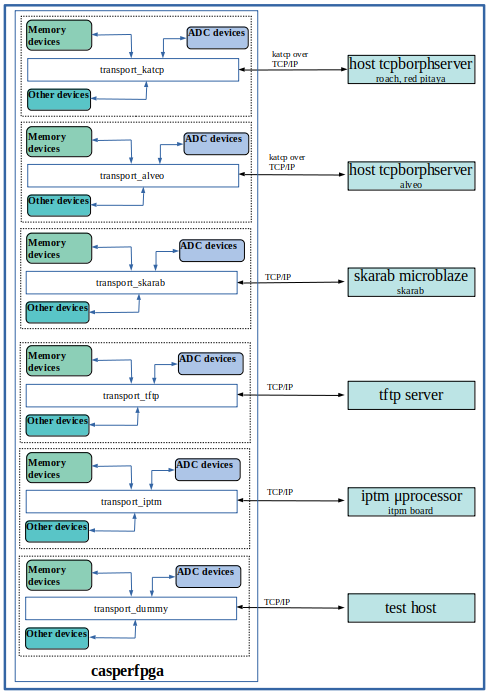
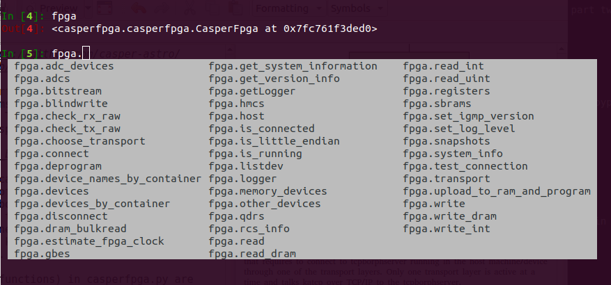
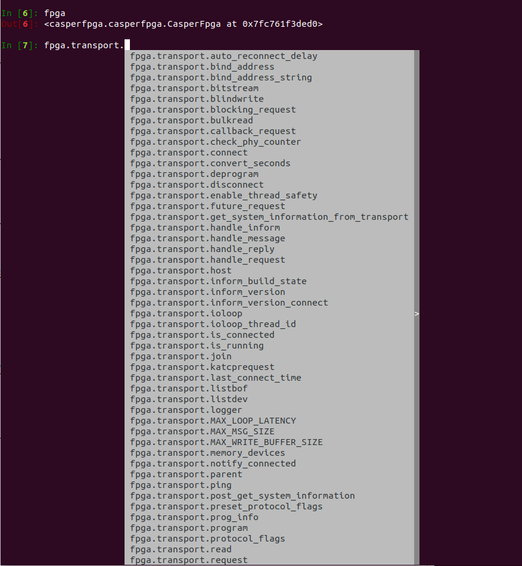
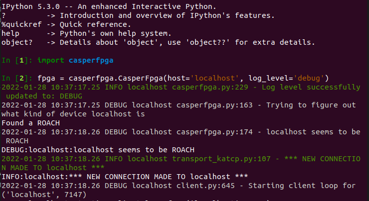
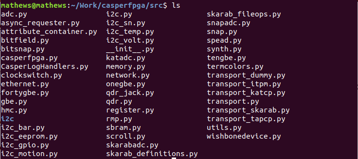

# Casperfpga Overview

`casperfpga` is a python library used to interact and interface with [**CASPER** Hardware](https://github.com/casper-astro/casper-hardware). It is primarily intended to be able to reconfigure firmware, as well as read and write registers across the various communication interfaces.

Casperfpga is well documented in terms of how to install it, the source code etc, as shown in the following links:

* [How to install casperfpga](https://casper-toolflow.readthedocs.io/projects/casperfpga/en/latest/How-to-install-casperfpga.html)

* [Migration from corr](https://casper-toolflow.readthedocs.io/projects/casperfpga/en/latest/migrating_from_corr.html)

* [Casperfpga source code](https://casper-toolflow.readthedocs.io/projects/casperfpga/en/latest/casperfpga.html)

* [README](https://github.com/casper-astro/casperfpga/blob/master/README.md)

However, casperfpga documentation requires more clarity in terms of its software structure and package directory structure. The following diagram attempts to clarify how casperfapga is structured:

## Block Diagram

The top-level casperfpga (casperfpga.py) is the heart of the software libarary that requires to connect to the host machine/device through one of the transport layers. Only one transport layer is active at a time.
* the transport_katcp connects to the host tcpborphserver and talks katcp over Transmission Control Protocol/Internet Protocol (TCP/IP) on port '7147'. Examples of hosts in this case are roach and red pitaya boards.
* the transport_alveo connects to the host tcpborphserver and talks katcp over TCP/IP on port '7147'. The host wil be the PC server that accomodates the Xilinx alveo acceleration cards.
* the transport_skarab connects to the soft core (microblaze) in the skarab fpga via 40GBe or 1 GBe TCP/IP ethernet.
* the transport_tapcp connects to the Trivial File Transfer Protocol (TFTP) server and communicates via TFTP protocol.
* the transport_itpm connects to the Italian Tile Processing Module (ITPM) server and communicates via TCP/IP.
* the transport_dummy is a dummy transport for testing. The IP address for dummy transport should be 127.0.0.1 which is the test host or localhost.

More information on the katcp library and documentation is found here:
[katcp](https://github.com/casper-astro/katcp_devel)

Memory devices

Casperfpga creates and adds memory devices to the memory device dictionary based on dictionary of information from tagged blocks in Simulink design and from information that could have been in coreinfo.tab (memory bus information). Such memory devices include xps:bram, xps:sw_reg, xps:ten_gbe, xps:hmc, etc. Known CASPER memory-accessible devices and their associated classes and containers are declared at the beginning in the casperfpga.py file.

Note: xps:skarab_adc has been placed under Memory devices following the casperfpga python code. However, it is believed that this could have placed under ADC devices below.

ADC devices

Casperfpga instantiates CASPER ADC objects and attach them to the parent CasperFpga object based on dictionary of information from tagged blocks in Simulink design. Such ADC devices include the xps:katadc. Known CASPER adc devices and their associated classes and containers are declared at the beginning in the casperfpga.py file.

Note: xps:skarab_adc has been placed in the memory devices list above following the casperfpga python code. However, it is believed that this could have placed under ADC devices here.

Other devices

Casperfpga stores non-memory device information based on dictionary of information from tagged blocks in Simulink design. Known CASPER other devices and their associated classes and containers are declared at the beginning in the casperfpga.py file.

## Software Structure

Base methods (functions) in casperfpga.py are available to all casperfpga hardware objects as shown below:

The most commonly used base methods which are used to invoke and achieve other functionality are briefly described below. The details of these methods are found in the source code, https://github.com/ska-sa/casperfpga/tree/master/src

read_int - read size-bytes of binary data with carriage-return escape-sequenced.

read-uint - read an unsigned integer from memory device.

write_int -  writes an integer to the device specified at the offset specified.

write - write data, then read it to confirm a successful write.

upload-to_ram_and program - upload an FPG file to RAM and then program the FPGA.

listdev - get a list of the memory bus items in this design.

is_connected - tests if the transport is connected to the host. 

is_running - tests if the FPGA is programmed and running.

estimate_fpga_clock - get the estimated clock of the running FPGA, in Mhz.

Transport specific methods are available on the underlying transport layer as shown below:

It should be emphasized that transport specific methods are only supported on CASPER hardware platforms that have support for that particular layer.

Upon initialisation, casperfpga detects which hardware platform is connected by checking the available transport layers. It connects to the first successful detection as shown below:

Casperfpga also has methods that are necessary to:

* create memory devices from dictionaries of design information.
* instantiate CASPER ADC objects and attach them to the parent CasperFpga object.

## Package Directory Structure

### Top-level Directory
The top-level directory of casperfpga consists of the following folders and files:

* src/ - contains all the casperfpga python lihttps://github.com/ska-sa/casperfpga/tree/master/srcbrary source files.
* scripts/ - contains utility python script files for various tasks eg  program/deprogram fpga device.
* progska/ - a SKARAB programming utility wriiten in C.
* debug/ - contains some SKARAB programming debug utilities.
* docs/ - contains files necessary for Sphinx documentation generation. See docs/README.md in this directory.

* requirements.txt - lists the necessary python software packages required to install and run casperfpga.
* setup.cfg - configuration file for casperfpga.
* setup.py -  the setup script used in building, distributing and installing python modules.
* LICENCE.txt - details the terms and conditions for copying, distribution and modification of the casperfpga software library.
* apt-build-requirements.txt - contains the meta-packages that links to several other packages that are necessary to compile C/C++ and python software/programs.
* MANIFEST.in - in this file, one adds or removes files to/from the source distribution.
* README.md - some documentation that details the installation and usage of casperfpga.
* casperfpga - is the symbolic link (symlink) to the /src folder.

Other generated files (during compilation) at top level are:

* build
* casperfpga.egg-info
* dist

### /src directory

This directory contains all the casperfpga python library source files. These relate to various memory devices, ADC devices, devices tagged in casper Simulink designs, device transport layers as well as those relating to various functionalities of casperfpga. The details of the methods in different source files are found at [Casperfpga source code](https://casper-toolflow.readthedocs.io/projects/casperfpga/en/latest/casperfpga.html).
New functionalities and transport layers are added as files in this directory while appropriate adjustments are made in casperfpga.py

## Conclusion

The document tried to provide a high level overview of the Casperfpga in terms of its software structure and package directory structure. The details of several blocks and functionalities are found in the source code as mentioned earlier. Developers are free to edit this document as and when required.
